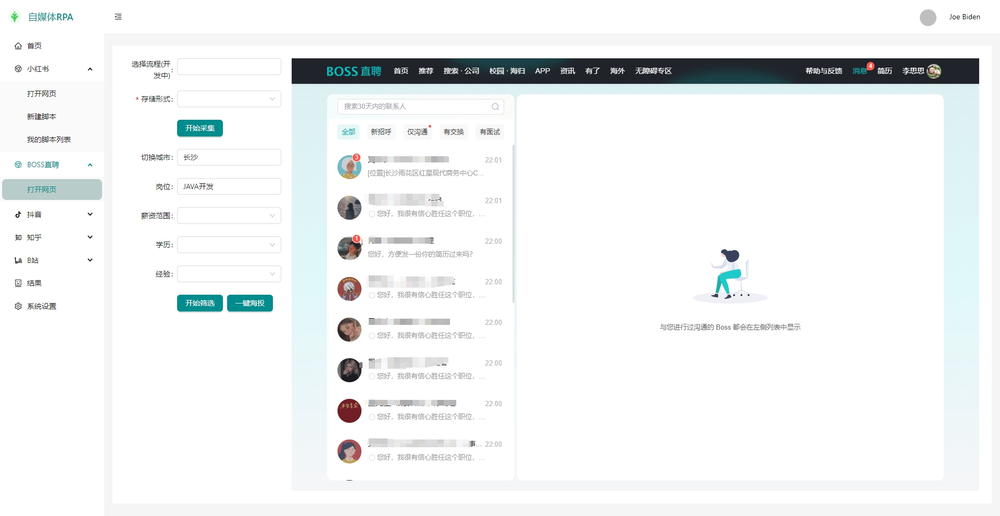
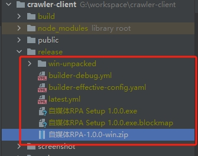

# <p align="center">获取小红书笔记，BOSS直聘岗位，抖音短视频等自媒体平台数据,筛选BOSS直聘简历，并一键海投</p>

[//]: # (https://github.com/ikatyang/emoji-cheat-sheet 表情仓库)

免责声明：

大家请以学习为目的使用本仓库

本仓库的所有内容仅供学习和参考之用，禁止用于商业用途。任何人或组织不得将本仓库的内容用于非法用途或侵犯他人合法权益。本仓库所涉及的技术仅用于学习和研究，不得用于对其他平台进行非法行为。对于因使用本仓库内容而引起的任何法律责任，本仓库不承担任何责任。使用本仓库的内容即表示您同意本免责声明的所有条款和条件。


## 🎞️ 项目原理

> 通过electron内嵌chroium浏览器绕过跨域限制，可以注入JS脚本 \
> 通过JS脚本模拟用户操作，获取各种数据。 \
> 通过JS脚本和主进程的通信，存储相关数据。 \
> 通过JS逆向模拟用户操作的方式，获取数据的阻碍小。 

BOSS直聘岗位一键海投：

以下是采集的小红书的笔记数据，未经任何修改：

以下是采集的BOSS直聘的视频数据，未经任何修改：

以下是采集的抖音的视频数据，未经任何修改：


## 🎨 运行指南

> 项目运行需要node环境 ，推荐node14+，作者使用的是node 18.20.2 \
> electron依赖比较大，需要科学上网工具或者配置镜像源 \
> 通过webview获取数据的进程通信脚本需要读取本地相对路径(file://),通过BrowserView则不需要 

### 1. 安装依赖

```bash
   npm install
```

### 2. 配置数据库

配置文件在`项目根目录\src\main\config\config.json`

```json
{
  "development": {
    "username": "root",
    "password": "123456",
    "database": "crawler",
    "host": "127.0.0.1",
    "dialect": "mysql"
  },
  "test": {
    "username": "root",
    "password": null,
    "database": "database_test",
    "host": "127.0.0.1",
    "dialect": "mysql"
  },
  "production": {
    "username": "root",
    "password": "liu435839449",
    "database": "database_production",
    "host": "127.0.0.1",
    "dialect": "mysql"
  }
}
```

### 3. 运行项目

```bash
   npm run start:web &  npm run start 
   或者
   npm run startAll
```

### 4. 编译项目
```
1、npm install                             - 安装依赖
2、npm run start:web  & npm run start      - 开发调试
3、npm run build:test:web  & npm run build - 编译测试环境生产
4、npm run build:web  & npm run build      - 编译windows生产
5、npm run build:web  & npm run build:deb  - 编译linux 生产

> 通过根目录下的electron-builder.yml配置进行编译
> 编译后的输出目录默认在根目录下的release文件夹（包括安装包，绿色启动exe文件，绿色包zip文件）
```


### 5. 热更新
```
1、配置electron-builder.yml下的publish字段的热更新地址
2、有新版本编译完成
3、将新编译的 exe包和 latest.yml放在热更新地址上，保证能直接访问
```

### 6、项目结构

```
├── crawler-client         # 自媒体采集RPA
├────  build               # web端编译输出静态文件目录
├────  public              # web端挂在根节点目录
├────  release             # 桌面应用编译后输出目录
├────  scripts             # 桌面应用自定义脚本目录（nsi自定义安装）
├── src                    # web前端代码目录
│   ├── main/              # electron主进程
│   │   ├── config/              # 数据库配置
│   │   ├── models/              # 数据库表配置目录
│   │   ├── services/            # sequelize操作sql服务目录
│   │   ├── dbUtils.js/          # db工具函数
│   │   ├── main.js/             # 桌面应用主入口
│   │   ├── preload.js/          # 主进程和渲染进程通信注册文件
│   │   ├── preload2.js/         # 主进程和webview通信注册文件
│   │   ├── processUtils/        # 工具函数
│   ├── renderder/         # electron渲染进程
│   │   ├── entry/               # web端入口目录
│   │   ├── layout/              # web端布局目录
│   │   ├── mock/                # web端初始化数据
│   │   ├── pages/               # web端页面目录
│   │   ├── redux/               # web端状态机目录
│   │   ├── routers/             # web端路由目录
│   │   ├── statics/             # web端静态资源目录
│   │   ├── utils/               # web端工具函数目录
│   ├── scripts/           # webview注入脚本目录
│   ├── static/            # 桌面应用静态资源目录（应用图标之类）
│   ├── utils/             # 工具函数目录
│   └── index.js/          # 空文件（勿删，会报错，craco V7 要求必须要有一个index.js）
├── package.json    
├── env.development        # 开发环境配置
├── env.production         # 生产环境配置
├── env.test               # 测试环境配置
├── .gitignore             # git忽略配置
├── electron-builder.yml   # 应用编译/分发/热更新配置
├── craco.config.js        # webpack配置
└── webstorm.config        # webstorm配置
```

## 💡 正在开发中的内容

> 正在开发的内容 2024/7/27
>

| 蓝图                         | 完成情况       | 存在问题        |
|----------------------------- |------------|-------------|
| 1、小红书增加采集笔记评论列表      | 已完成     | 暂无  |
| 2、小红书批量关注               | 开发中    | 暂无  |
| 3、抖音增加采集短视频评论列表      | 开发中    | 暂无  |
| 4、抖音批量关注                 | 开发中    | 暂无  |
| 5、流程引擎                    | 开发中    | 暂无  |
| 6、解释器                      | 开发中    | 暂无  |
| 7、执行器                      | 开发中    | 暂无  |
| 8、存储                        | 开发中    | 暂无  |

## 🌟 Star History

<br>

[](https://star-history.com/#liumengniu/crawler-client&Timeline)


