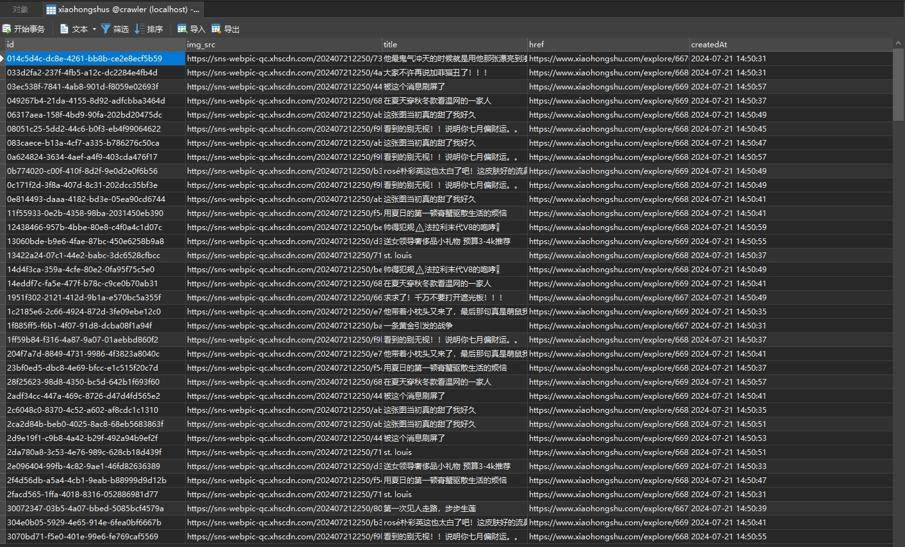
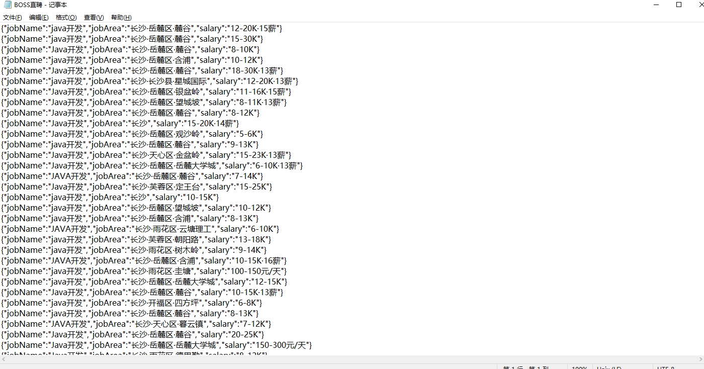
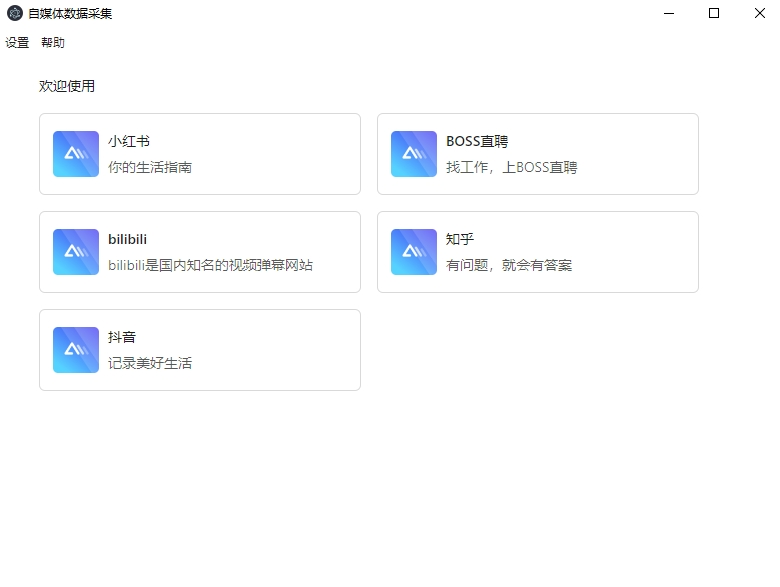

# <p align="center">通过JS脚本模拟用户操作，获取小红书笔记，BOSS直聘岗位，知乎帖子，b站视频等自媒体平台数据</p>

[//]: # (https://github.com/ikatyang/emoji-cheat-sheet 表情仓库)

免责声明：

大家请以学习为目的使用本仓库

本仓库的所有内容仅供学习和参考之用，禁止用于商业用途。任何人或组织不得将本仓库的内容用于非法用途或侵犯他人合法权益。本仓库所涉及的技术仅用于学习和研究，不得用于对其他平台进行非法行为。对于因使用本仓库内容而引起的任何法律责任，本仓库不承担任何责任。使用本仓库的内容即表示您同意本免责声明的所有条款和条件。


## 🎞️ 项目原理

> 通过electron内嵌chroium浏览器绕过跨域限制，可以注入JS脚本 \
> 通过JS脚本模拟用户操作，获取各种数据。 \
> 通过JS脚本和主进程的通信，存储相关数据。 \
> 通过JS逆向模拟用户操作的方式，获取数据的阻碍小。 \
> 以下是采集的小红书的笔记数据，未经任何修改：
> 
> 
> 以下是采集的抖音的视频数据，未经任何修改：
> 
> 以下是采集的BOSS直聘的视频数据，未经任何修改：
> 
> 工具app截图：
> 
> 客户端渲染本地采集数据：
> 

## 🎨 运行指南

> 项目运行需要node环境 ，推荐node14+，作者使用的是node 18.20.2 \
> electron依赖比较大，需要科学上网工具或者配置镜像源 \
> 通过webview获取数据的进程通信脚本需要读取本地相对路径(file://),通过BrowserView则不需要 

> 1. 安装依赖

```bash
   npm install
```

> 2. 运行项目

```bash
   npm run startAll
```

> 3. 编译项目

```bash
   npm run build:web 
   npm run build 
```

## 💡 正在开发中的内容

> 正在开发的内容 2024/7/27
>

| 蓝图                       | 完成情况       | 存在问题        |
|---------------------------|------------|-------------|
| 1、小红书采集自定义流程          | 开发中     | 暂无  |
| 2、BOSS直聘采集自定义流程        | 开发中    | 暂无  |
| 3、BOSS直聘岗位精准筛选          | 开发中    | 暂无  |
| 4、BOSS直聘一键海投             | 开发中    | 暂无  |

## 🌟 Star History

<br>

[](https://star-history.com/#liumengniu/crawler-client&Timeline)


